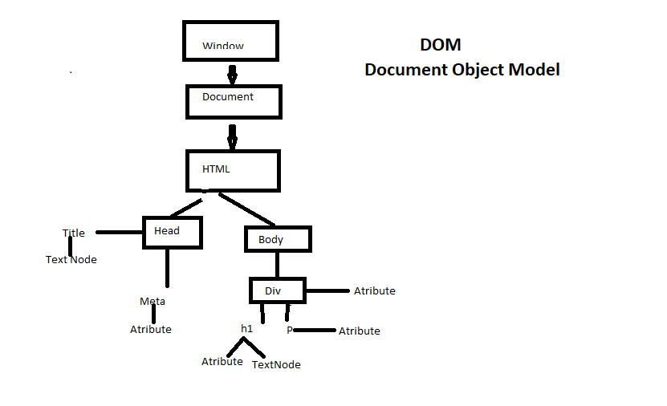
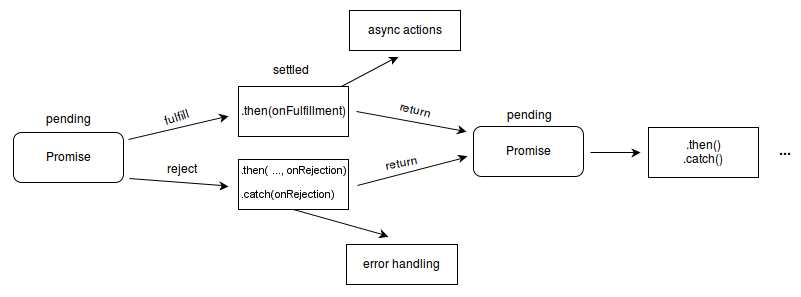

md: markdown
## Js is the dynamically typed language

## javaScript is the single thread

## Stack and heap memory :
## primitive data type goes to stack we get a copy of that value,

## Non-Primitive datatype goes to Heap we get a reference of that value.
 
## null -> datatypes -> object
## function -> datatypes -> objectFunction

## object can be decleared in two ways :
## 1. literals 2. constructor

## literals se singleton nahi banta but,
## constructor se singleton banta hai
 
## how js work behind the scene**(later)

## JavaScript Execution context are : 
two are important 
## 1.Global execution context
## 2.Function Execution Context
## 3.Eval Execution context

diagram on dom
## window --> Document --> html -->1.head, 2.body


#way of writing code 

```javascript

console.log("hello world")

```

## All about Synchronous
## default javascript behaviour
## javascript --> Synchronous(One by one code executions), Single thread

## Execution context --> execute one line of code at a time 
like 
## !->console log - 1 (1 will print)
## !->console log - 2 (2 will print)

## each operations waits for the last one to complete before executing


## task queue make javascript fast

## Synchronous execution means task happen in a sequential, blocked manner --> where one task must finish before the next start --> also known as the blocking execution
eg - imagine a restaurant, you have to wait until your meal is prepared before you can eat

## Asynchronous allows task to run concurrently , without blocking other operations --> task can overlap and run independently of each other --> also known as the non-blocking execution
eg - imagine ordering online , you can go about your day and get a notifications when your order is ready

--Its prefered to use the asynchronous but its totally 
depends upon conditions--

 
## json formatter website used to formate the api data

## how to get api of any users

[api.github.com/users/priyanka-saw]

## XMLHttpReqest : used to connect with servers , this enables a web pages to updates just part of a page without disrupting what the user is doing  

## can retrive any types of data , not just only XML

## it is used heavily in AJAX programming
## (AJAX)Asynchronous Javascript and XML

## Value	State	Description
0 	UNSENT	Client has been created. open() not called yet.

1	OPENED	open() has been called.

2	HEADERS_RECEIVED	send() has been called, and headers and status are        available.

3	LOADING	Downloading; responseText holds partial data.

4	DONE	The operation is complete. 


## promise
The Promise object represents the eventual completion (or failure) of an asynchronous operation and its resulting value.

# three states
- pending: initial state, neither fulfilled nor rejected.
- fulfilled: meaning that the operation was completed successfully.
- rejected: meaning that the operation failed




# OOPS
javascript does have classes, but its important ot note that javascript is primarily a (prototype-based language)
- given syntactic sugar (so that developers can make class and objects)


## parts of oop
Object literals 

- Constructor
- Prototypes
- Classes
- Instances (new, this)

## 4 pilars
- Abstraction
- Encapsulations
- Inheritances
- Polymophism

#prototype
- prototypes are the mechanism by which javascript objects inherit features from one  another